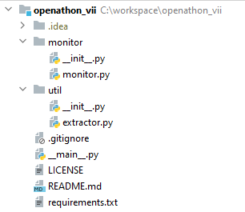

<p align="center">
    
</p>

# Lab 07 - Empezando una aplicación Python

Ahora que ya hemos explorado los básicos de Python, es hora de meterse en harina, vamos a crear nuestra primera aplicación Python. La aplicación que vamos a realizar en este Openathon VI es una herramienta de monitorización de los niveles de CPU y RAM de nuestro propio equipo (algo como el administrador de tareas de Windows, ¡vaya!). Antes de comenzar a teclear código como locos, vamos a definir la estructura de la aplicación, así como las funcionalidades que tendrá. A lo largo de los siguientes laboratorios iremos aplicando los conceptos aprendidos para crear, poco a poco, nuestra primera aplicación Python.

## Funcionalidades

La aplicación que vamos a construir, se trata de una herramienta que se ejecutará en nuestro equipo local, sin necesidad de acceso a Internet. Como hemos anticipado en la introducción, lo que haremos será monitorizar los niveles de CPU y RAM de nuestro propio equipo y dibujarlos sobre una gráfica que se irá actualizando en el tiempo. A modo de resumen, la aplicación nos permitirá:

1. Capturar los valores de uso de RAM de nuestro equipo en un momento concreto
2. Capturar los valores de uso de CPU de nuestro equipo en un momento concreto
3. Refrescar los datos cada *x* milisegundos, siendo *x* un parámetro de entrada de la aplicación que nosotros mismos definiremos
4. Crear una gráfica para visualizar los valores del uso de RAM
5. Crear una gráfica para visualizar los valores del uso de CPU
4. Mostrar el valor más reciente de ambos valores en la barra de título de la ventana de la aplicación

En este Openathon, además de Python, también aprenderemos a trabajar con **programación reactiva** en este lenguaje, que nos permitirá actualizar los datos en nuestra interfaz de una forma eficiente y sencilla. 

## Estructura

Como ya hemos visto, Python permite trabajar con módulos, que no son más que una forma de ordenar nuestro código fuente, equivalente a los paquetes en Java. Aunque vamos a crear una aplicación pequeña y podría tentarnos el hacerla en un único fichero, vamos a estructurarla de forma que esté preparada para crecer (y nos de algo más de juego en el Openathon :wink:).

<p align="center">
    
</p>

## Configuración del entorno

Antes de empezar a construir la aplicación, vamos a configurar un entorno virtual. Un entorno virtual, es un paquete autocontenido de una versión de Python y un conjunto de librerías adicionales. Cuando se trabaja con proyectos reales, como en el resto de lenguajes de programación, es habitual que se necesiten utilizar ciertas librerías de terceros que nos aporten funcionalidades concretas (como haremos en este Openathon). Ahora bien, imagínate que trabajas en varios proyectos que requieren versiones distintas de la misma librería ¿Cómo se gestiona eso en Python? Con entornos virtuales. Si quieres saber más sobre los entornos virtuales en Python, te recomiendo que leas la [página de la documentación oficial](https://docs.python.org/3/tutorial/venv.html) dedicada a ello.

Vamos a inicializar nuestra aplicación Python. Lo primero de todo, será crear una carpeta en nuestro sistema de ficheros con el nombre de la aplicación. Si te sientes más cómod@, puedes utilizar el explorador de toda la vida 😉.

```
mkdir mi-monitor
```

Si nos equivocamos o cambiamos de opinión mientras la creábamos podemos renombrarla con el comando:

```
mv <nombre_actual> <nuevo_nombre>
```

Una vez creada la carpeta, vamos a crear un entorno virtual dentro de ella, que no deja de ser otro directorio con toda la instalación de Python autocontenida. Te recomendamos que llames a esa carpeta .venv. Para crearlo, nos movemos a dentro de la carpeta que creamos en el paso anterior y ejecutamos el siguiente comando:

```
cd mi-monitor

python3 -m venv .venv
```

Para activar el entorno, debemos ejecutar el siguiente comando:

Windows:
```
.venv\Scripts\activate.bat
```

Unix:
```
source .venv/bin/activate
```

Cuando lo actives, verás que en el intérprete aparece (.venv) como prefijo:

```
(.venv) C:\workspace\mi-monitor>
```

Además, si quieres confirmar que efectivamente estás utilizando el entorno virtual correctamente, puedes acceder al intérprete de python y ejecutar las siguientes sentencias:

```
(.venv) C:\workspace\mi-monitor> python

Python 3.8.2 (tags/v3.8.2:7b3ab59, Feb 25 2020, 23:03:10) [MSC v.1916 64 bit (AMD64)] on win32
Type "help", "copyright", "credits" or "license" for more information.
>>> import sys
>>> sys.path
['', 'C:\\Users\\{user}\\AppData\\Local\\Programs\\Python\\Python38\\python38.zip', 'C:\\Users\\{user}\\AppData\\Local\\Programs\\Python\\Python38\\DLLs', 'C:\\Users\\{user}\\AppData\\Local\\Programs\\Python\\Python38\\lib', 'C:\\Users\\{user}\\AppData\\Local\\Programs\\Python\\Python38', 'C:\\workspace\\mi-monitor\\.venv', 'C:\\workspace\\mi-monitor\\.venv\\lib\\site-packages']

```

Si te fijas, dentro del array de salida, podrás ver que está incluyendo las librerías alojadas dentro del entorno virtual. ¡Ya estás listo! Ya no tendrás conflictos si trabajas con varios proyectos Python simultáneamente. En el siguiente laboratorio empezaremos con nuestra aplicación Python haciendo uso de este entorno virtual.

:warning: Asegúrate de realizar toda la práctica con el entorno activado, de lo contrario, estarás utilizando diferentes versiones de Python y es posible que tengas conflictos con las librerías.

:memo: Para desactivar el entorno virtual, tan sólo tienes que ejecutar el comando ```deactivate``` ubicando en la misma carpeta que el script de activación.

[< Lab 06](../lab-06) | [Lab 08 >](../lab-08)

<p align="center">
    
</p>
