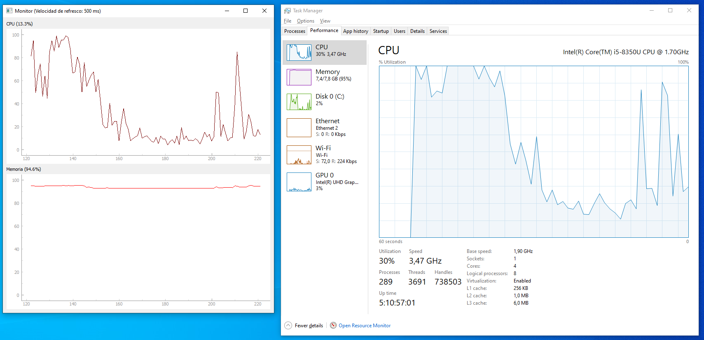

<p align="center">
    
</p>

# Lab 12 - Haciendo nuestra aplicación reactiva :rocket::rocket:

La programación reactiva es un paradigma de programación orientado al trabajo con flujos de datos infinitos. Es un paradigma que está en auge porque cada día las aplicaciones deben estar preparadas para trabajar con una mayor cantidad de datos de forma eficiente. Si no conoces este paradigma de programación, te recomendamos echarle un ojo a las siguientes píldoras:

- [Programación reactiva: Teoría I](https://mediaexchange.accenture.com/media/t/1_0ra40rmt)
- [Programación reactiva: Teoría II](https://mediaexchange.accenture.com/media/t/1_dk9s22db) 

El objetivo de este laboratorio es convertir la aplicación del laboratorio anterior en reactiva, haciendo uso de la librería reactiva para Python RxPy. Te dejamos el enlace a la [documentación oficial](https://rxpy.readthedocs.io/en/latest/), por si quieres leer más sobre ella.

Puedes continuar con el código que hayas escrito tu mismo o, si lo prefieres, puedes tomar como punto de partida el código subido en [este mismo laboratorio](./mi-monitor). 

## Instalando RxPy

Como te imaginarás, lo primero de todo es instalar la librería reactiva para Python. El nombre del paquete es Rx, deberás añadir al fichero requirements.txt e instalar la versión 3.1.0. Si no recuerdas como hacerlo, puedes revisar el [laboratorio nueve](../lab-09).

:warning: Ten en cuenta que al instalarlo desde el fichero de requisitos, te volverá a intentar instalar todas las librerías. En aquellas que ya tengas instaladas, te saldrá un mensaje "Dependency already satisfied".

## Generando un flujo de datos continuo

No es el objetivo del laboratorio profundizar en la teoría de la programación reactiva, sin embargo, si es importante que comprendas que programar de forma reactiva supone un cambio a la hora de enfocar un problema. 

Hasta ahora, nuestro QTimer se encargaba explícitamente de actualizar los valores de la gráfica y el valor del título. Sin embargo, a partir de ahora, el QTimer se encargará de refrescar nuestro origen de datos pero será la interfaz la que esté pendiente de los nuevos valores, para hacer las actualizaciones pertinentes. En otras palabras, vamos a generar un flujo continuo de datos y haremos que nuestra aplicación esté pendiente de los nuevos valores.

¡Manos a la obra! Lo primero de todo es crear, al comienzo del método \_\_init\_\_.py de la clase Monitor, un Observable. Para ello, escribiremos la siguiente línea de código:

``` python
# ...

from rx.subject import Subject

class Monitor(QMainWindow):

    def __init__(self, refresh):
        
        self.events_cpu = Subject()

        # ...
```

Ahora, modificaremos la función que se invoca cada x segundos para que, en lugar de forzar la actualización de la interfaz, solamente envíe un nuevo valor al Observable. Localiza la función ```get_cpu_data``` y sustitúyela por el siguiente código:

```python
def get_cpu_data(self):
    # Publica un nuevo valor en el Observable de valores de la CPU
    self.events_cpu.on_next(self.extractor.get_cpu_percent())
```

:memo: Ejecuta si quieres ahora tu aplicación, verás que mientras que la gráfica de la memoria RAM sigue actualizándose, la gráfica de la CPU se queda inmóvil. ¿Por qué ocurre esto? Porque el QTimer, para la CPU, solamente está publicando un nuevo valor en el Observable pero ¡nadie escucha esos nuevos valores!

## Obteniendo los valores de forma reactiva

Ahora necesitaremos que la interfaz "escuche" ese Observable para enterarse cuando ocurran los cambios y poder ejecutar las acciones correspondientes. Recuerda, en programación reactiva los cambios se disparan cuando se publican nuevos eventos. Por tanto, debemos invocar al método ```update_cpu_data``` de nuestra clase Monitor cuando haya un nuevo valor.

Para añadir el código, localiza en el fichero \_\_main\_\_.py la línea ```sys.exit(app.exec_())``` y añade el siguiente código **justo encima**:
```python

# ...

# Nos suscribimos a los cambios en los valores de la CPU
monitor.events_cpu.subscribe(
    # Cuando se publique un nuevo elemento, invocamos a la función update_cpu_data, pasándole el nuevo valor
    on_next=lambda x: monitor.update_cpu_data(x),
    # Cuando se produzca un error, lo imprimimos por consola y no actualizamos el gráfico
    on_error=lambda e: print(e),
    # Cuando se complete el observable (no se produzcan más valores) se sale de la aplicación
    on_completed=lambda: sys.exit(0)
)

sys.exit(app.exec_())
```

Como puedes ver, el método subscribe recibe tres parámetros.

:one: on_next, es la función que se ejecuta cuando se recibe un nuevo valor. En este caso, invocaremos al mismo método que estabamos utilizando antes, el cuál refrescará la interfaz.

:two: on_error, es la función que se ejecuta cuando se produce un error en el flujo de eventos. En este caso, solamente imprimiremos la excepción, pero podríamos realizar, por ejemplo, alguna acción de control.

:three: on_completed, es la función que se ejecuta cuando el flujo de eventos finaliza. En este caso, el flujo de eventos no finaliza nunca, pero podría haber otra situación en la que si finalizase.

Ya está, hemos terminado de implementar la lógica reactiva. Como puedes ver, no supone un gran cambio de código fuente, sin embargo, el rendimiento a la hora de trabajar con flujos de datos asíncronos es mucho mejor. 

:memo: Ejecuta el código. A nivel visual, deberías obtener el mismo resultado que en laboratorio anterior.

:dart: ¡Reto! Debemos seguir los mismos pasos para conseguir que nuestro flujo de datos de memoria RAM sea reactivo. ¿Te atreves? En la carpeta [solución final](../solucion-final/mi-monitor) tienes el código fuente completo :wink:

Una vez que hayas acabado el código fuente, te animamos a que ejecutes, en paralelo, la aplicación que acabas de crear con el administrador de tareas de tu sistema operativo. Aunque no hemos hecho hincapié en temas estéticos, podrás comprobar que los valores mostrados en las gráficas son, cuanto menos, similares. Te adjuntamos una captura de pantalla de cómo deberías ver el resultado.

<p align="center">
    
</p>

[< Lab 11](../lab-11)

<p align="center">
    
</p>
